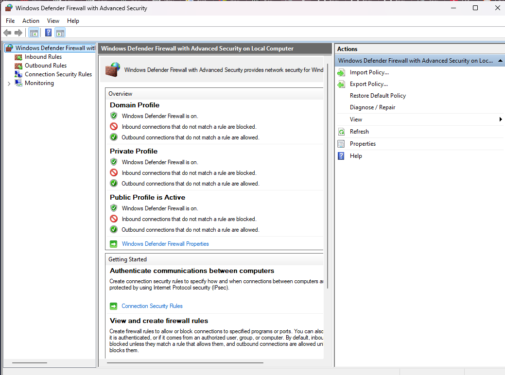
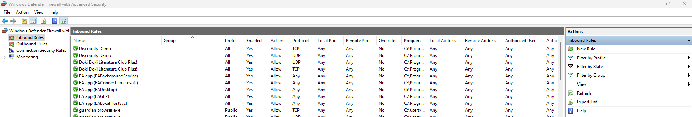
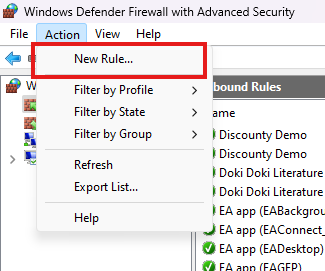
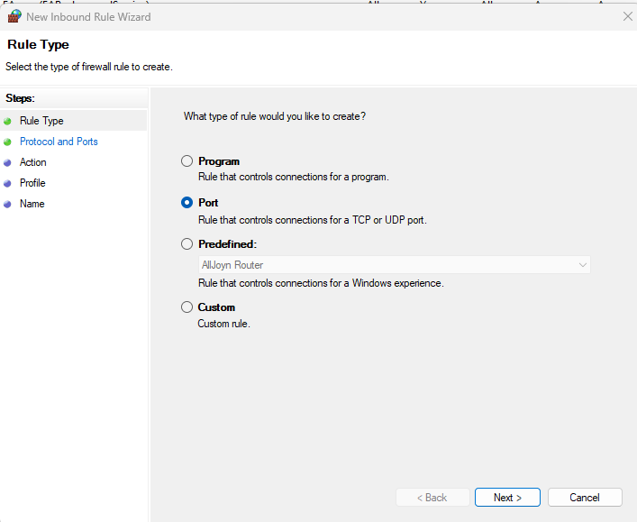
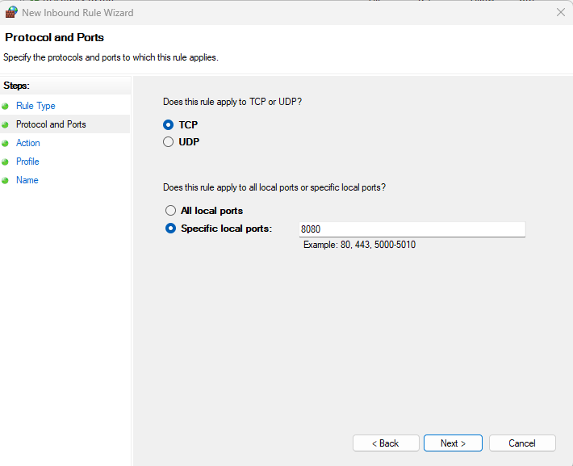
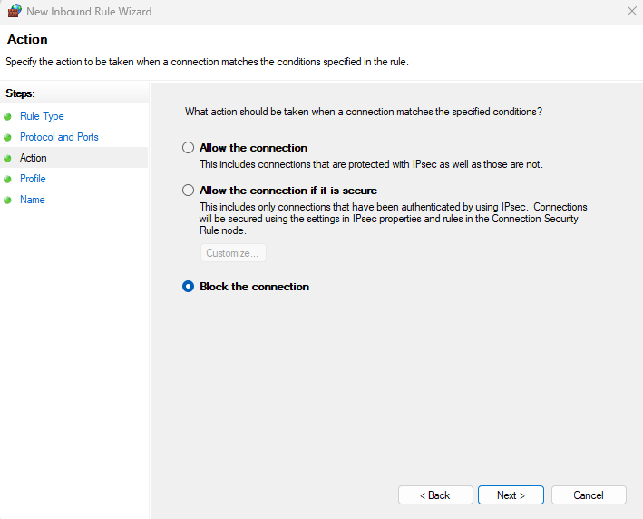
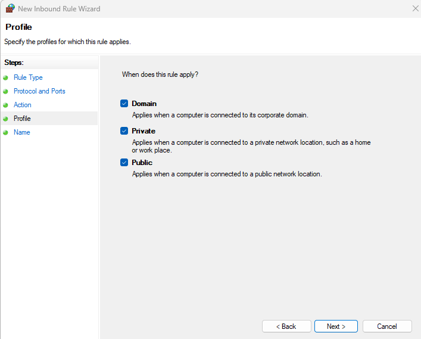
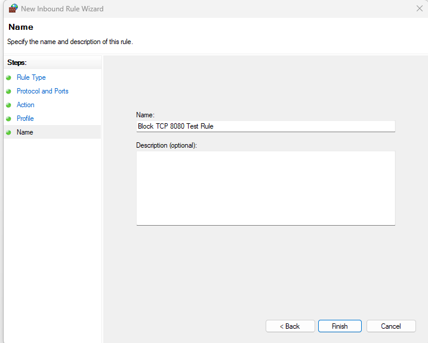
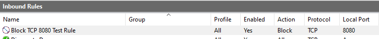

# Configuring Windows Defender Firewall Rules

## Objective
Use Windows Defender Firewall with Advanced Security to review and configure firewall rules that help control inbound and outbound network traffic on a Windows system.

## Tools Used
- Windows Defender Firewall with Advanced Security

## Environment Used
- Windows 11 Pro

## Lab Description
This lab focuses on using Windows Defender Firewall with Advanced Security to review and configure firewall rules on a Windows system. Host-based firewalls are an important part of system security because they help control what traffic is allowed to enter or leave a device.

In this exercise, I reviewed existing firewall settings and created a temporary inbound rule to block TCP port 8080 across the Domain, Private, and Public profiles in order to better understand how Windows Defender Firewall can be used to manage network access, reduce unnecessary exposure, and support system hardening.

## Skills Demonstrated
- Navigating Windows Defender Firewall with Advanced Security
- Reviewing inbound and outbound firewall rules
- Creating and modifying firewall rules
- Understanding basic host-based firewall concepts
- Documenting security configuration changes

## Procedure

---

From the taskbar, click the **Windows Start** icon and search for **Windows Defender Firewall with Advanced Security**, then open it from the Start menu.

---

In the left pane, review the following sections:
- **Inbound Rules**
- **Outbound Rules**
- **Connection Security Rules**
- **Monitoring**

These sections provide visibility into how traffic is being filtered and what rules are currently active on the system.

---

Click **Inbound Rules** to view the list of configured inbound firewall rules. These rules control what incoming traffic is allowed or blocked.

Review details such as:
- rule name
- group
- profile
- enabled status
- action
- protocol
- local port
- remote port

---

To create a new firewall rule, select **New Rule** from the **Actions** pane or menu.

---

For this lab, select **Port** as the rule type.

---

Under **Protocol and Ports**, select **TCP** and enter **8080** as the specific local port.

---

Under **Action**, select **Block the connection**.

---

Under **Profile**, apply the rule to:
- **Domain**
- **Private**
- **Public**

---

Enter a name for the rule. For this lab, I used **Block TCP 8080 Test Rule**.

---

After completing the wizard, review the newly created rule in the firewall console to confirm that it appears as expected and is enabled.

---

If needed, double-click the rule to open its **Properties** window. From there, review or modify:
- general settings
- programs and services
- protocol and ports
- scope
- advanced profile settings
- action behavior

## Configuration Notes
When reviewing or creating firewall rules, I focused on the following items:
- **Direction** to determine whether the rule affected inbound or outbound traffic
- **Action** to confirm whether traffic was allowed or blocked
- **Protocol and Ports** to identify exactly what traffic the rule applied to
- **Profiles** to control where the rule would be enforced
- **Enabled Status** to verify that the rule was active

For demonstration purposes, I created a temporary test rule named **Block TCP 8080 Test Rule**, captured screenshots of the configuration process, and removed the rule after completing the lab.

## Key Takeaways
- Windows Defender Firewall helps control inbound and outbound traffic on a host.
- Firewall rules can be configured by port, program, predefined template, or custom settings.
- Reviewing firewall rules helps identify what traffic is allowed into or out of a system.
- Properly configured firewall rules can reduce unnecessary exposure and support system hardening.

## Why This Matters
Knowing how to review and configure Windows Defender Firewall rules is a useful foundational skill in IT and cybersecurity. System administrators and security professionals use host-based firewalls to limit access, reduce attack surface, and better protect systems from unauthorized or unnecessary network communication.
